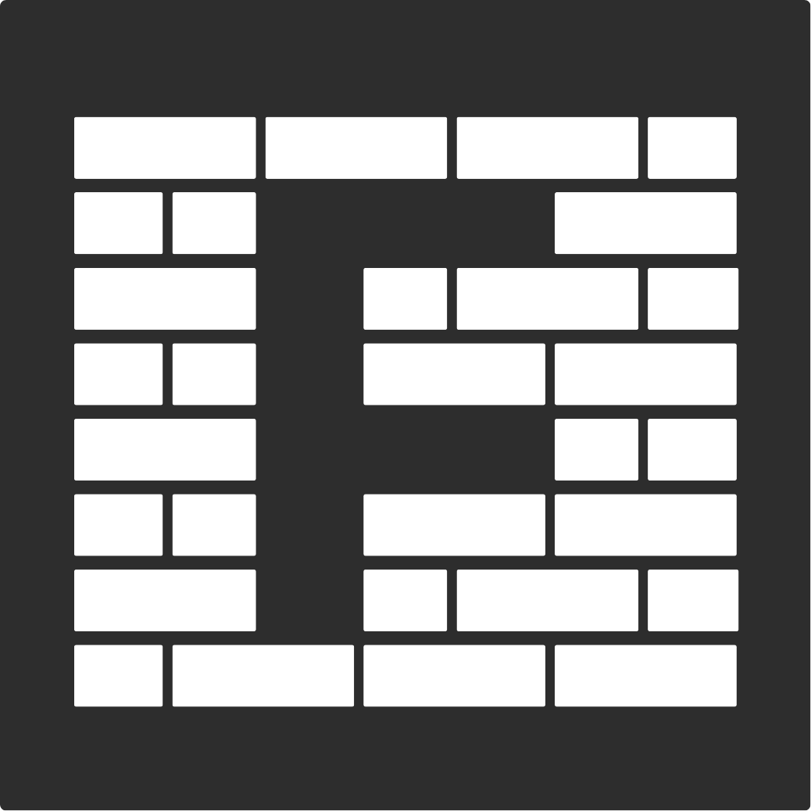
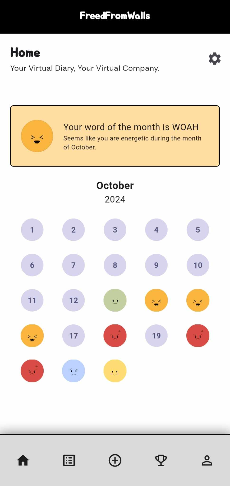
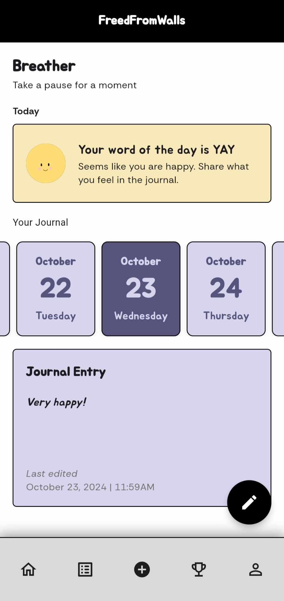
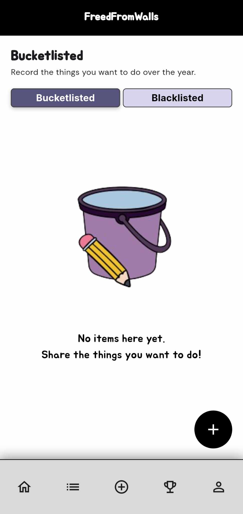
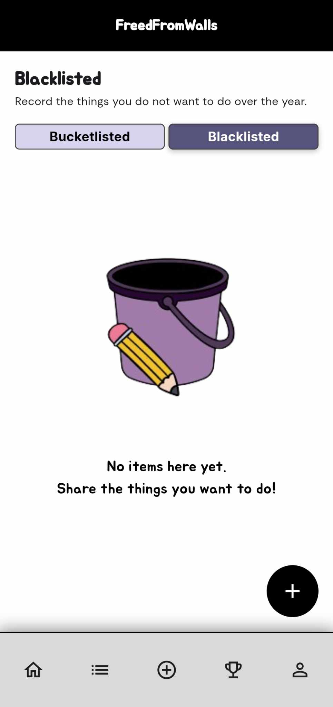
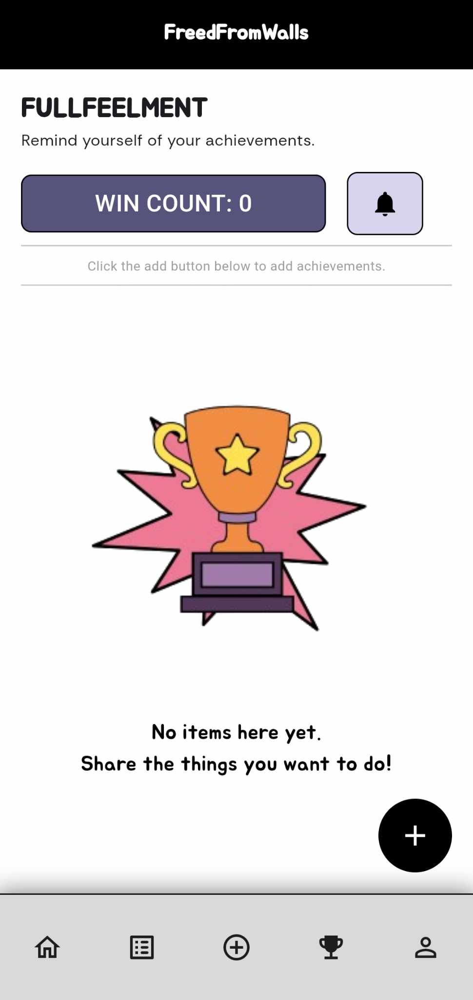
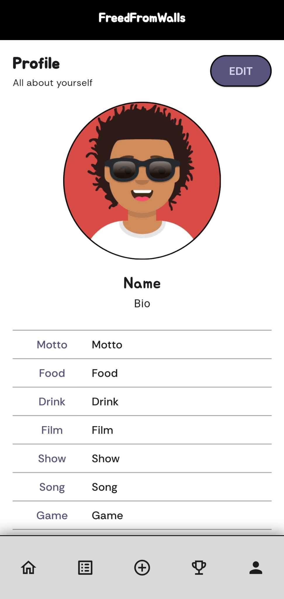

# FreedFromWalls: A Virtual Diary and Mood Tracker

FreedFromWalls is a digital journaling and mood tracking application that serves as both a virtual diary and a virtual company. The name is a double entendre - it represents both a freedom wall where users can share their perspectives without interference, and liberation from traditional social media walls.

## Features

### 🏠 Home

- Monthly mood tracking dashboard

- Customized calendar

- Multiple theme options (Default, Sunrise, Sunset, Midnight)

### 🌬️ Breather

- Daily mood selection with 10 emotion options

- Digital journaling with timestamp tracking

- Notes management system

- Scrollable calendar for historical entries

### 📝 Bucketlisted/Blacklisted

<table>
<tr>
<th> Bucketlisted screen</th>
<th> Blacklisted screen </th>
</tr>
<tr>
<td>

</td>
<td>

</td>
</tr>
</table>

- To-do list management

- Not-to-do list tracking

- Easy item creation, modification, and deletion

### 🏆 Fullfeelment

- Achievement tracking system

- Customizable win notifications

- Win count dashboard

- Achievement management tools

### 👤 Profile

- Customizable avatars (12 options)

- Editable screen name and birthday

- Bio management

- Personal preferences configuration

---

FreedFromWalls - Your safe space for self-expression and personal growth.

